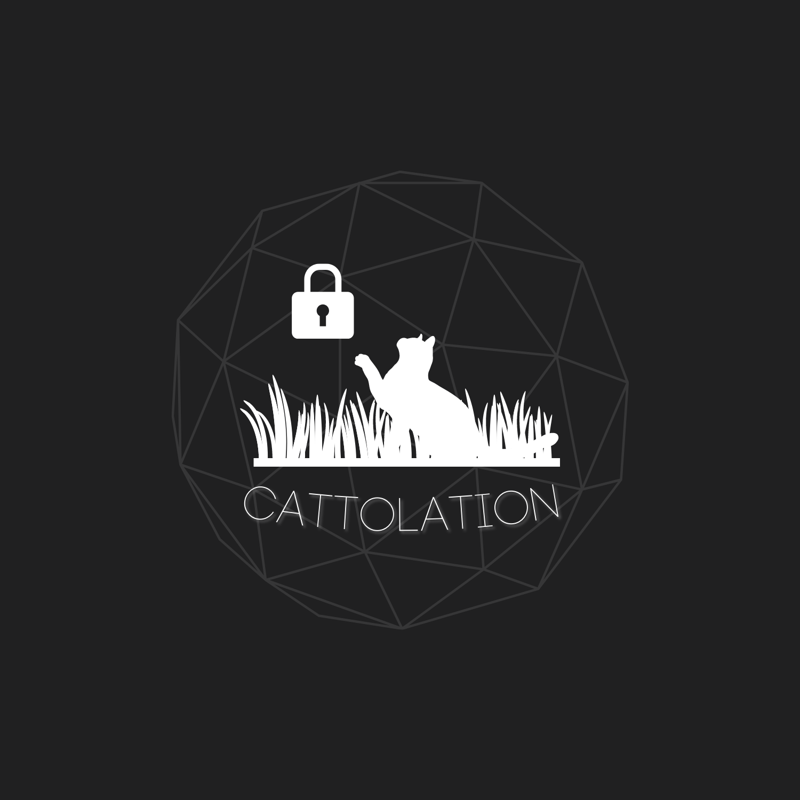

  

###

  
  

###

<h1 align="center">cattolation@GitHub:~> echo "Hello World"</h1>

###

<h3 align="left">cattolation@GitHub:~> About Me</h3>

###

Hi, I'm Tay Gao Jun.

As a cybersecurity professional who recently graduated from Ngee Ann Polytechnic with a Diploma in Cybersecurity and Digital Forensics, I bring both technical expertise and a genuine passion for protecting digital assets. My journey in cybersecurity began during my role as a Cyber Wellness Ambassador, where I discovered my calling in this field.

Through hands-on experience in penetration testing and ethical hacking, I've developed a comprehensive understanding of cybersecurity principles and their real-world applications. What drives me is not just the technical challenges, but the opportunity to make a meaningful impact in an increasingly connected world.

I firmly believe that the cybersecurity landscape is constantly evolving, and so should we. This mindset has shaped my approach to professional development, where I actively seek opportunities to grow and share knowledge with others in the community.

###

<h3 align="left">cattolation@GitHub:~> Skills</h3>

###

  
  
  
  
  
  
  

###

<h3 align="left">cattolation@GitHub:~> Stats</h3>

###

  

###

<h3 align="left">cattolation@GitHub:~> Most Used Languages</h3>

###

  

###
